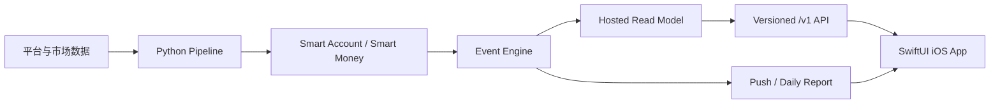

# bSmart 第一阶段 MVP 开发路线图

> 历史版本：本文件记录 2026-08-03 的宽口径持仓事件路线。当前执行计划已由
> `smart-intelligence-mvp-development-plan.md` 取代；涉及 MVP 范围、优先级和里程碑时以后者为准。

> 状态：执行计划
> 制定日期：2026-08-03
> 产品范围真源：`docs/product/product-direction-mvp.md`

## 1. 第一阶段完成的定义

第一阶段不是“把现有 Web 搬进 iOS”，也不是完成若干数据页面。只有下面的闭环可以由真实用户稳定使用，
才算 MVP 完成：

1. 用户无需连接券商即可手动建立持仓，填写股票、成本价和仓位；
2. 系统持续接收 Smart Account 与 Smart Money 数据；
3. Event Engine 识别与持仓相关的重要变化，保存当时的证据与覆盖状态；
4. iOS 首页按严重度、仓位影响和时间展示事件；
5. 高价值事件通过 Push 主动提醒，普通事件进入每日摘要；
6. 用户能看到发生了什么、为什么重要、与持仓的关系、原始证据和下一步研究方向；
7. 数据不足时明确降级，不能用 mock 或 AI 猜测补齐；
8. 产品能记录激活、事件阅读、提醒打开、证据点击和“是否有帮助”等验证数据；
9. App 达到 TestFlight 和 App Store 发布所需的稳定性、隐私与合规要求。

第一阶段明确不包含券商交易、自动跟单、钱包交易或 HIP-3 执行。

## 2. 当前基线

### 已完成

- iOS 17+ 原生 SwiftUI 工程和 XcodeGen 配置；
- `Today / Portfolio / Research / Smart` 四个主场景；
- 手动持仓、本地保存、重复 ticker 更新和删除；
- 持仓事件过滤，以及严重度、仓位权重、时间排序；
- 事件详情、证据、资金覆盖状态和下一步研究；
- Smart Account-only 的“暂无资金验证”降级场景；
- `/v1` OpenAPI 初始读取契约、Bundle Fixture 和 HTTP Client；
- 首批模型与排序单元测试，模拟器构建和启动验证。

### 尚未完成

- Fomo 风格的完整原生视觉系统与高保真交互；
- 首次使用引导、持仓编辑、通知设置、每日摘要和设置页；
- 生产 `/v1` API、写入接口、分页、缓存和身份会话；
- 面向持仓事件的正式 Event Engine；
- 实时数据调度、事件去重、证据快照和数据质量监控；
- APNs 推送、深链、提醒频控与每日摘要；
- 分析埋点、用户反馈、StoreKit 2 订阅与权益；
- TestFlight、隐私材料、风险披露、可访问性和发布监控。

## 3. 目标系统边界



新增生产 API 应作为独立运行时边界实现，推荐使用 Python FastAPI，并从托管 Postgres/Supabase 的
客户端读模型取数。它不得放进当前静态导出的 Next.js Web，也不得在 API 请求中运行爬虫、LLM 或
Score 计算。Pipeline 负责生成结果，API 只负责鉴权、查询、分页、用户状态与反馈。

建议新增目标目录：

```text
api/                         # FastAPI 运行时服务
  routes/                    # /v1 endpoints
  schemas/                   # 与 OpenAPI 对齐的请求/响应模型
  repositories/              # hosted read model 访问
  services/                  # portfolio/event/report/push 编排
  tests/
pipeline/domain/events/      # 平台无关事件规则与证据模型
pipeline/jobs/events/        # 增量事件生成、去重与发布
ios/BSmart/Features/         # 原生产品场景
```

## 4. 发布路线

| 里程碑 | 目标 | 数据状态 | 对外范围 |
|---|---|---|---|
| A. Internal Alpha | 完整、可点击的原生前端闭环 | 契约 Fixture | 团队内部 |
| B. Closed Beta | 真实持仓事件、推送和每日摘要 | 生产 API + 真实数据 | 邀请用户 |
| C. Public MVP | 订阅、发布质量和商业验证 | 稳定生产系统 | App Store |

## 5. 详细实施阶段

### M0：契约与验证基线

**状态：大部分完成。**

剩余任务：

- 给 OpenAPI 增加契约版本、游标分页、错误对象和数据生成时间；
- 补齐事件详情、已读/保存/忽略/反馈、持仓 CRUD、设备注册和日报接口；
- 为所有 Fixture 加 schema 校验，CI 中禁止契约漂移；
- 明确第一批股票池及每只股票的 Smart Account / Smart Money 覆盖状态；
- 建立事件类型、严重度、覆盖状态和证据来源枚举的兼容规则。

验收标准：iOS 模型、OpenAPI、API schema 和 Fixture 使用同一套字段；未知枚举不会让整个首页解码失败。

### M1：iOS 高保真前端 Alpha

这是下一步的最高优先级，先使用 Fixture 完成，不等待后端。

#### M1.1 原生设计系统

- 提炼 Fomo 的移动优先特征：极简深色底、强对比数字、短信息流、固定底部导航、快速 Sheet 和明确状态色；
- 只借鉴布局与交互语言，不复制其品牌资产、图标或交易文案；
- 统一颜色、排版、间距、8px 以内圆角、边框、阴影、触感反馈和动效时长；
- 建立 `EventRow`、`PositionRow`、`EvidenceBadge`、`ScoreAvatar`、`MetricStrip`、`FilterMenu`、
  `BottomSheet`、Skeleton、Empty、Error 等共享组件；
- 支持 Dynamic Type、VoiceOver、Reduce Motion 和触控热区。

#### M1.2 首次使用与持仓

- 首次进入直接说明“添加持仓后，bSmart 才能判断哪些变化与你有关”；
- 搜索受控股票池，添加 ticker、成本价、持仓数量或占比；
- 支持编辑、删除、重新排序和字段校验；
- 明确数据只用于个性化事件；
- 首次持仓完成后直接进入对应事件，不增加无价值问卷。

#### M1.3 Today 持仓事件流

- 顶部只展示组合摘要和需要关注的事件数量；
- 事件卡突出 ticker、变化、发生时间、仓位影响和证据覆盖；
- 提供“全部 / 风险 / 机会 / 未读”轻量筛选；
- 支持已读、保存、忽略和下拉刷新；
- 无事件、数据延迟、仅 Smart Account 和离线缓存均有明确状态。

#### M1.4 事件详情

- 固定顺序：结论、与持仓关系、Smart Account、Smart Money、反方/限制、下一步研究；
- 证据按来源分组并可打开原始帖子、视频或链上记录；
- 明确显示数据时间、覆盖状态和 AI 解释边界；
- 增加“有帮助 / 不相关 / 太晚了”反馈；
- 支持 Push Deep Link 直接打开事件。

#### M1.5 Research 与 Smart

- Research 保留股票搜索、当前结论、最近关键变化和精选观点，不复制 Web 全量看板；
- 叙事作为 Research 内的机会发现入口，不新增第五个主 Tab；
- Smart 分为 Smart Account 和 Smart Money 两个平行入口；
- Smart Account 展示 Score、擅长领域、周期、近期新观点和历史证据；
- Smart Money 展示公开地址信号、方向变化、规模、数据限制，不暗示传统机构身份。

#### M1.6 设置与通知预览

- 通知总开关、立即提醒、每日摘要、安静时段和关注股票；
- 数据来源、评分方法、风险说明、隐私和反馈入口；
- 用本地通知模拟真实 Push，先验证完整交互。

验收标准：新用户可以在 90 秒内添加持仓并读完第一条事件；所有核心流程在 Fixture、空数据、错误和
离线四种状态下可用；iPhone 常见尺寸无横向溢出或不可点击区域。

### M2：生产 API 与用户状态

- 首次启动创建匿名安装会话，不用登录即可完成激活；
- 使用 Keychain 保存会话令牌，使用 SwiftData/受保护文件保存离线持仓与事件缓存；
- 增加持仓 `POST / PATCH / DELETE`，服务端保存 ticker、成本和仓位以支持 Push；
- 增加 `GET /events` 游标分页、事件详情、已读、保存、忽略和反馈接口；
- 增加 Research、Smart Account、Smart Money、Daily Report 和 Device Token 接口；
- 响应携带 `generatedAt`、`dataAsOf`、`coverage`、`schemaVersion` 和 ETag；
- iOS 改为 stale-while-revalidate：先显示缓存，再后台刷新，不以全屏 Loading 阻塞切页；
- Sign in with Apple 仅用于跨设备恢复和订阅，不作为首次使用门槛。

验收标准：生产构建不包含 Fixture；断网可读最近缓存；接口失败只影响对应模块；用户持仓受行级权限
保护；任何平台密钥、LLM 密钥和数据库凭据都不进入客户端。

### M3：Event Engine

#### 输入

- Smart Account：高分作者新覆盖、方向改变、共识形成/打破、观点失效；
- Smart Money：高分公开地址开仓、加减仓、平仓、方向反转和聚集变化；
- Market/Fundamental：价格、波动、新闻与基本面只作为上下文证据。

#### 处理

- 候选事件生成；
- 数据质量、样本量、时效性和流动性门槛；
- 同 ticker、同类型、同时间窗去重与状态更新；
- Smart Account 与 Smart Money 的确认、背离和资金领先判断；
- 证据快照保存，确保事件以后仍能还原当时看到的证据；
- 严重度计算与用户仓位影响计算分离；
- AI 只根据结构化事实生成解释，不允许引入输入中不存在的事实；
- 保存 prompt/model/version、输入证据和输出，支持审计与重放。

#### 输出

- 事件必须包含变化前后状态、证据、覆盖、限制、结论和下一步研究；
- Smart Money 不足时生成 Smart Account-only 事件并标注“暂无资金验证”；
- 不满足门槛的候选进入内部质量队列，不发送给用户。

验收标准：每个正式事件都能回溯到原始证据；重跑同一窗口不会重复发事件；没有持仓信息也不会改变
市场事实；低样本、过期和缺失数据不会被描述为确定信号。

### M4：真实数据覆盖与运行

- 第一批以 MU、MSTR、NVDA 作为数据质量基准；
- 再从现有热门股票池中选择同时达到社媒和 Hyperliquid 最低门槛的股票扩展，不强行凑数量；
- Smart Account 增量检测目标：X/短文本在平台条件允许时 15 分钟内，YouTube 60 分钟内；
- Smart Money 增量检测目标：5 分钟内；
- 每个来源记录最后成功时间、滞后、错误率、待处理量和有效证据数；
- 建立翻译、完整口播、Call 抽取、Score、价格和原始链接完整度检查；
- 管线发布的是只读事件/研究模型，不向 iOS 暴露原始 SQLite 表。

验收标准：连续 14 天自动运行无需人工补数据；来源中断不会制造反向信号；所有正式股票都能在 App
中看到真实 `dataAsOf` 和覆盖说明。

### M5：Push 与每日摘要

- APNs token 注册、失效和环境隔离；
- 立即提醒只用于高价值事件，普通事件进入日报；
- 同一事件状态更新不重复轰炸，设置 cooldown 和每只股票上限；
- 支持安静时段、股票级开关和风险/机会偏好；
- Push 文案只包含事实变化和 ticker，不直接给买卖指令；
- 点击通知通过 Universal Link / App Deep Link 打开对应事件；
- 每日摘要按持仓影响汇总“最重要变化、风险、机会、暂无变化”。

验收标准：开发、测试、生产 Push 环境隔离；通知可追踪送达和打开；禁用通知后服务端不再发送；日报
不会重复立即提醒的同一内容。

### M6：验证与商业化

- 定义激活漏斗：启动 → 添加持仓 → 看到事件 → 阅读详情 → 打开证据；
- 记录事件打开、阅读、保存、忽略、反馈、通知打开和日报阅读；
- 不采集原帖正文、剪贴板或与产品无关的设备信息；
- 增加 StoreKit 2、本地 entitlement 缓存和服务端收据状态；
- Closed Beta 先验证价值，不立即用 Paywall 阻断首次事件；
- Public MVP 再测试免费额度、试用期和 Pro 价格；
- Score 和事件排序不能因为交易、订阅或商业合作而被修改。

验收标准：可以回答用户是否完成激活、是否因提醒返回、哪些事件被认为有帮助，以及用户是否愿意为
持续提醒付费；分析失败不影响核心产品使用。

### M7：发布与质量门槛

- 单元测试：排序、持仓影响、缓存、枚举兼容、通知策略；
- 契约测试：OpenAPI、API、Fixture 和 Swift 模型一致；
- 管线测试：事件门槛、去重、覆盖降级、证据快照和 AI 输出校验；
- UI 测试：首次使用、添加持仓、事件阅读、Push Deep Link、订阅恢复；
- 性能目标：有缓存时首屏 1.5 秒内可读，切 Tab 不出现全屏阻塞，长列表保持流畅；
- 完成 VoiceOver、Dynamic Type、Reduce Motion 和深色模式检查；
- 接入崩溃与 API 运行监控，建立数据源延迟告警；
- 准备隐私清单、隐私政策、风险披露、数据删除、支持渠道和 App Review 说明；
- 通过 Internal TestFlight → 20–50 人 Closed Beta → 分批公开发布。

## 6. 优先级

### P0：没有就不能发布

- M1 完整前端闭环；
- 生产 API、匿名会话、持仓同步和缓存；
- Event Engine、证据快照和真实数据质量门槛；
- Push、日报、Deep Link；
- 核心埋点与事件反馈；
- 隐私、风险披露、崩溃监控和 TestFlight 验证。

### P1：应在 Public MVP 前完成

- StoreKit 2 订阅；
- Sign in with Apple 跨设备恢复；
- 精简叙事机会发现；
- Smart Account / Smart Money 详情和筛选；
- 更完整的通知偏好。

### P2：第一阶段后再决定

- 券商连接与交易；
- 自动建议、自动跟单或仓位调整；
- 全市场覆盖；
- 原生社区 Feed；
- 钱包连接和 HIP-3 交易。

## 7. 并行开发顺序

| 工作流 | 第一批 | 第二批 | 第三批 |
|---|---|---|---|
| iOS | M1 设计系统与全流程 | M2 API/缓存替换 | Push、订阅、发布 QA |
| API | 契约与匿名会话 | 持仓/事件/反馈/设备 | 报告、订阅、监控 |
| Pipeline | Event contract 与候选规则 | 去重、证据快照、发布 | 稳定性与数据质量告警 |
| Product/Data | 股票池与质量门槛 | 事件人工审查 | Beta 反馈与门槛调整 |

依赖顺序必须保持：契约先于 API，API 先于客户端切换；数据门槛先于 Push；真实事件准确性先于付费墙。

## 8. 建议周期

以下估算假设一名 iOS 工程师与一名后端/数据工程师并行；若由一人串行完成，周期应相应延长：

- 第 1–2 周：M0 收尾 + M1 高保真 Internal Alpha；
- 第 2–4 周：M2 API 与 M3 Event Engine 并行；
- 第 4–6 周：M4 真实数据、M5 Push 和 Closed Beta；
- 第 6–7 周：M6 分析、反馈和 StoreKit；
- 第 8 周：M7 TestFlight QA 与发布材料。

双人并行的理想目标约为 8 周；单人串行更现实的范围是 12–16 周。数据源稳定性、Apple 审核和外部
服务审批不应承诺固定日期。

## 9. 下一执行批次

下一批开发只做 M1，不等待后端：

1. [已完成] 重构 iOS 设计 token 和共享组件；
2. [已完成] 完成 Fomo 风格 Today 事件流；
3. 完成持仓首次使用、添加与编辑；
4. 重构事件详情为证据驱动阅读页；
5. 对齐 Research、Smart、设置和通知预览；
6. 为四种状态和主要尺寸补 Preview、截图与 UI 测试；
7. 保持现有 Fixture 契约与功能逻辑不变，完成后再进入 M2。

当前视觉基线采用年轻化的深色社交交易语言：突出持仓总值和变化，事件使用可扫读的动态流表达，并通过
青绿、红、金和蓝编码机会、风险、优先级与信息来源。它只借鉴 Fomo 的移动信息层级，不复制其品牌、
交易组件或社交社区功能。
