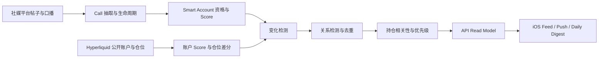

# bSmart Smart Intelligence MVP 开发计划

> 状态：当前执行计划
> 制定日期：2026-08-04
> 产品范围真源：`docs/product/product-direction-mvp.md`
> 主客户端：iOS 17+ 原生 SwiftUI

## 1. 产品切入口

第一版只解决一个问题：

> 用户持有或准备买入一只股票时，及时告诉他高 Score 投资博主刚刚说了什么、链上聪明资金刚刚做了
> 什么，以及二者是否正在形成确认、背离或领先关系。

第一版不与券商、行情终端或财经资讯平台竞争。价格、成本价和仓位是个性化上下文，不是独立产品；新闻、
财报、宏观、基本面和技术指标不建设为首发功能。

## 2. MVP 完成定义

同时满足以下条件，才算 MVP 完成：

1. 用户能手动添加持仓和关注标的，并填写可选成本价与仓位占比；
2. 系统能持续发现合格 Smart Account 的新观点、观点加强、反转、失效和首次覆盖；
3. 系统能持续发现合格 Smart Money 账户的开仓、增仓、减仓、平仓和方向反转；
4. 系统能识别观点与资金的确认、背离、观点领先和资金领先；
5. iOS 首页按用户相关性和变化重要性展示统一信号流；
6. 高优先级信号通过 Push 主动提醒，普通变化进入每日摘要；
7. 每条信号都能回溯到原始帖子、完整口播或链上仓位证据；
8. Smart Money 数据不足时明确显示“暂无资金验证”，不把缺失解释为中性；
9. App 能记录提醒打开、信号阅读、原始证据点击和用户反馈；
10. 真实数据连续运行 14 天后达到 Closed Beta 稳定性门槛。

### 2.1 首发范围矩阵

| 层级 | 首发范围 | 边界 |
|---|---|---|
| 用户上下文 | 手动持仓、关注标的、可选成本价与仓位占比 | 不要求注册、券商连接、钱包连接或完整投资画像 |
| Smart Account | 合格作者的新观点、加强、减弱、反转、关闭、失效与首次覆盖 | 不做社区 Feed，不把热度等同于质量，不声称作者真实持仓 |
| Smart Money | Hyperliquid 代币化美股公开账户的有效仓位变化 | 不等同于机构持仓，不扩展到传统券商账户或全链地址终端 |
| 关系信号 | 确认、背离、观点领先、资金领先 | 只有单侧证据时允许展示，但必须明确另一侧暂无验证 |
| 用户交付 | Today 信号流、Push、每日摘要、Ticker Intelligence、原始证据 | 不建设泛化新闻、财报、技术指标或行情终端 |
| 个性化 | 股票、成本价、仓位占比、关注状态 | 个性化只改变相关性、优先级和解释，不改变市场事实 |

价格和市场状态只用于解释成本位置、仓位影响、事件新鲜度和链上市场有效性，不能独立生成正式信号。AI
只负责把已验证的结构化事实解释为可读结论与下一步研究动作，不补造证据，不直接给出买卖或杠杆指令。

## 3. 第一版核心对象

### 3.1 Smart Account Update

描述一位合格投资作者对某只股票的最新有效观点变化：

- 作者、平台、Score、平台分位和擅长周期；
- 股票、方向、发布时间、观点周期和目标价；
- 核心论据、失效条件和原始证据；
- `new / strengthened / weakened / reversed / closed / invalidated` 生命周期；
- 相较该作者上一条同标的有效观点发生了什么变化。

不是所有新帖子都进入产品。无明确投资判断、低质量重复、搬运、无作者归属或不满足作者池门槛的内容只
保留在内部审计层。

### 3.2 Smart Money Movement

描述一位合格公开链上账户对代币化美股市场的最新有效仓位变化：

- 匿名账户标识、账户 Score 和历史样本；
- 股票映射、市场、方向、名义金额和仓位变化比例；
- `opened / increased / reduced / closed / flipped` 动作；
- 变化前后仓位、杠杆、实现与未实现结果；
- 链上数据时间、市场流动性和覆盖限制。

产品只能称其为公开链上账户或 Smart Money，不能称为机构、传统股票持仓或某位博主本人。

### 3.3 Portfolio Signal

面向用户交付的统一信号，由前两类对象和用户持仓上下文派生：

| 信号类型 | 触发条件 |
|---|---|
| 高 Score 作者新观点 | 合格作者发表新的 actionable Call |
| 作者观点转向 | 同一作者对同一股票加强、减弱、反转或关闭判断 |
| Smart Account 共识变化 | 多位独立高 Score 作者在滚动窗口内形成或打破集中方向 |
| Smart Money 仓位异动 | 合格账户发生超过账户与市场自适应门槛的仓位变化 |
| 观点与资金确认 | 两条信号流在匹配周期内方向一致且都达到最低样本 |
| 观点与资金背离 | 两条信号流在匹配周期内方向相反且都达到最低样本 |
| 观点领先 | Smart Account 先发生显著变化，资金尚未跟随 |
| 资金领先 | Smart Money 先发生显著变化，作者尚未集中讨论 |

价格波动、财报和新闻不能独立触发 `Portfolio Signal`。

## 4. 用户流程

### 4.1 首次使用

启动 App → 添加持仓或关注股票 → 填写可选成本价和仓位 → 生成个人信号流 → 阅读第一条信号。

不要求注册、连接券商、填写投资风格问卷或连接钱包。匿名安装会话和本地持仓足以完成激活。

### 4.2 日常提醒

收到 Push → 打开信号详情 → 阅读变化、持仓影响和两类证据 → 打开原始证据 → 保存、忽略或反馈。

Push 只表达事实变化，不给出直接买卖、仓位或杠杆指令。

### 4.3 主动研究

搜索股票 → 查看当前 Smart Account 状态 → 查看 Smart Money 最新动作 → 查看二者关系 → 展开时间线与
原始证据。

股票页不是通用研究终端，不加入财务报表、新闻 Feed 和指标库。

### 4.4 机会发现

只展示两类新机会：高 Score 作者首次集中覆盖的新股票，以及聪明资金先行且随后出现作者关注的股票。
机会发现不作为首发主 Tab，先从 Today 和搜索页的次级入口进入。

## 5. iOS 信息架构

### Today

- 持仓和关注标的摘要；
- 统一 Smart Account / Smart Money 信号流；
- `全部 / 观点 / 资金 / 确认与背离 / 未读` 筛选；
- 每张卡只展示变化、时间、关联股票、持仓关系和证据覆盖；
- 支持已读、保存、忽略、刷新和离线缓存。

### Portfolio

- 手动持仓和关注标的；
- 成本价、仓位占比与当前覆盖状态；
- 添加、编辑、删除和重新排序；
- 不建设收益分析和组合风险终端。

### Ticker Intelligence

- 当前 Smart Account 共识及七日前对比；
- 最新高 Score 作者观点和生命周期；
- 当前 Smart Money 状态与最新显著动作；
- 确认、背离或单侧覆盖结论；
- 原始证据时间线。

### Smart

- Smart Account 与 Smart Money 两个平行入口；
- 作者/账户排名、擅长范围、历史证据和最新动作；
- 支持关注作者或账户，关注后进入个人信号流；
- 不建设社区、聊天、发帖或 Copy Trading。

### Settings

- Push、每日摘要、安静时段与股票级开关；
- 数据来源、Score 方法、风险说明、隐私和反馈；
- 后续加入订阅与跨设备恢复。

## 6. 数据与算法工作流

### 数据时效目标

| 数据 | Internal Alpha | Closed Beta 目标 |
|---|---:|---:|
| X 等短文本新观点 | 60 分钟内 | 20 分钟内 |
| YouTube 完整口播观点 | 6 小时内 | 90 分钟内 |
| Smart Money 仓位变化 | 15 分钟内 | 5 分钟内 |
| 高优先级 Push | 派生后 10 分钟内 | 派生后 3 分钟内 |
| 每日摘要 | 手动生成 | 用户时区固定时间自动生成 |

bSmart 不与毫秒级新闻终端竞争。第一版优化的是“重要变化被发现并送达”的总延迟。

### 数据质量门槛

- Smart Account 只能使用发布当时可获得的历史 Score，不用当前排名回填过去；
- YouTube Call 必须来自完整口播证据，标题和摘要不能单独生成正式判断；
- 每条 Call 保存作者归属、方向、周期、目标、失效条件和原始片段；
- Smart Money 账户必须具备最低历史长度、已结算行为和市场流动性；
- 仓位变化使用账户自身历史和市场规模的自适应门槛，避免固定金额偏向巨鲸；
- 关系事件要求匹配股票、方向、观点周期和时间窗口；
- 所有事件保存生成时证据快照，后续数据变化不能改写历史通知；
- 低样本、数据延迟、来源中断和市场关闭都必须成为显式状态。

## 7. API 与存储边界

推荐新增独立 FastAPI 服务与托管 Postgres Read Model。Pipeline 负责抓取、Call 抽取、Score、账户分析、
变化检测和信号生成；API 只负责用户状态、查询、分页、反馈、设备注册与缓存，不在请求过程中运行爬虫或 LLM。

首批 API：

- `GET /v1/feed`：个人统一信号流；
- `GET /v1/signals/{id}`：信号详情与证据快照；
- `GET /v1/tickers/{symbol}/intelligence`：标的双信号状态；
- `GET /v1/smart-accounts` 与 `/{id}`；
- `GET /v1/smart-money/accounts` 与 `/{id}`；
- `GET/POST/PATCH/DELETE /v1/portfolio`；
- `GET/POST/DELETE /v1/watchlist`；
- `POST /v1/devices`：APNs token；
- `POST /v1/signals/{id}/feedback`；
- `GET /v1/daily-digest`。

所有读取响应必须包含 `schemaVersion`、`generatedAt`、`dataAsOf`、`coverage` 和稳定游标。iOS 使用
stale-while-revalidate：先展示本地缓存，再后台刷新，不用全屏 Loading 阻塞切页。

## 8. 开发里程碑

发布采用三个不可跳过的闸门：

| 发布门 | 验证问题 | 通过条件 |
|---|---|---|
| Internal Alpha | 用户能否快速建立持仓并看懂两类证据 | Fixture、空数据、延迟、错误和离线状态均可用；核心路径通过模拟器与测试 |
| Closed Beta | 真实重要变化能否稳定、及时、无误导地送达 | 首发股票池连续运行 14 天；证据完整、去重、时效和 Push 达到 M6 门槛 |
| Public MVP | 产品能否形成持续使用与付费价值 | 留存与事件反馈可观测；隐私、订阅、稳定性和 App Store 材料通过发布检查 |

### M0：范围与契约锁定

**目标：1 周内完成。**

- 将正式事件源限制为 Smart Account、Smart Money 和二者关系；
- 定义三类核心对象、生命周期和兼容枚举；
- 更新 OpenAPI、Fixture 与 Swift 模型；
- 确定 3 只内部基准股票，并按双覆盖门槛确定首发热门股票池；
- 为每只股票输出 Smart Account / Smart Money 覆盖审计；
- 建立事件证据快照、去重键和时间字段规范。

验收：契约、Fixture、Swift 和 Pipeline schema 一致；未知枚举可降级；没有新闻、财报或价格单独事件。

### M1：iOS Internal Alpha

**目标：第 1–2 周。使用 Fixture，不等待生产 API。**

- 完成年轻化原生设计系统和 Today 统一信号流；
- 完成手动持仓、关注标的、成本价和仓位编辑；
- 重构事件详情为“变化 → 持仓关系 → 观点 → 资金 → 限制 → 原始证据”；
- 将 Research 收敛为 Ticker Intelligence；
- 完成 Smart Account / Smart Money 追踪页；
- 增加本地通知预览、空数据、单侧覆盖、延迟和错误状态；
- 补 Preview、主要尺寸截图、VoiceOver 和核心 UI 测试。

验收：新用户 90 秒内添加持仓并读完第一条信号；四个核心流程在离线和错误状态下可用。

### M2：真实 Smart Account 增量链路

**目标：第 2–4 周。**

- Smart Account 直接复用原 Web 端 `sv_investor_score` 排名、平台资格、历史时点 Score 与 `sv_call`；
  不建立第二套作者池，不在 Client API 或 iOS 端重算排名；
- 为首发股票池运行平台增量抓取；
- 完整翻译、YouTube 口播、Call 抽取与证据定位；
- 作者历史时点 Score 和平台资格进入事件判断；
- 实现作者新观点、加强、减弱、反转、关闭、失效和首次覆盖检测；
- 同作者同标的重复观点净额化，多作者形成共识变化；
- 建立数据延迟、抓取失败、翻译和口播完整度监控。

验收：抽样事件均能回到原帖或口播片段；重跑不重复；连续 7 天增量运行无人工补数据。

### M3：真实 Smart Money 增量链路

**目标：第 2–4 周，与 M2 并行。**

- 接入首发代币化美股市场、公开账户和仓位快照；
- 建立账户历史表现、样本强度和 Smart Money 资格；
- 计算开仓、增仓、减仓、平仓和翻转；
- 使用自适应金额与仓位比例门槛过滤噪声；
- 保存链上证据和市场覆盖状态；
- 建立数据源延迟、映射错误、低流动性与极端杠杆监控。

验收：每个正式动作可由前后快照复算；低流动性不生成高确定性结论；连续 7 天稳定运行。

### M4：Signal Engine 与生产 API

**目标：第 4–6 周。**

- 合并单侧更新，生成确认、背离和领先关系；
- 按持仓、成本、仓位、变化幅度、Score、资金规模和新鲜度排序；
- 保存不可变证据快照、覆盖状态、解释与限制；
- 实现匿名会话、持仓、关注、Feed、详情、反馈和设备接口；
- iOS 切换为缓存优先的生产 API；
- 补契约测试、权限隔离、游标分页、ETag 和回滚能力。

验收：同一输入幂等；不同用户只因持仓上下文改变优先级，不改变市场事实；断网可读最近缓存。

### M5：Push 与每日摘要

**目标：第 6–7 周。**

- APNs token 注册、环境隔离、失效清理和 Deep Link；
- 高 Score 作者显著转向、Smart Money 大幅动作、确认与背离进入立即提醒；
- 普通新观点和小幅动作进入每日摘要；
- 实现去重、冷却时间、每股票上限、安静时段和股票级开关；
- 通知与详情显示相同证据快照和生成时间。

验收：关闭通知后不再发送；同一信号状态更新不轰炸；点击 Push 直接打开对应详情。

### M6：14 天 Dogfood 与 Closed Beta

**目标：第 7–9 周。**

- 团队使用真实持仓连续运行 14 天；
- 每条正式信号进行相关、及时、可解释和证据完整度审查；
- 记录打开、阅读、证据点击、保存、忽略和反馈；
- 招募 20–50 名目标用户，验证提醒是否改变其研究行为；
- 调整事件门槛、频控和股票池，不增加新数据品类；
- 接入崩溃、API、数据延迟和 Push 监控。

进入 Public MVP 的门槛：关键崩溃为零；正式信号原始证据完整率 100%；重复 Push 率低于 1%；至少
80% 的信号在目标时效内送达；用户能区分观点、资金和“暂无资金验证”。

### M7：订阅与 App Store 发布

**目标：第 9–11 周。**

- StoreKit 2、权益缓存、恢复购买和服务端订阅状态；
- 免费版用于体验有限股票和摘要，Pro 提供更多持仓、及时提醒与历史信号；
- 价格与额度通过 Beta 实验确定，不在工程中预先锁死；
- 完成隐私清单、隐私政策、数据删除、风险披露、支持入口和审核说明；
- Internal TestFlight → Closed Beta → 分批公开发布。

验收：订阅失败不影响已有数据读取；Score 和信号排序不受付费与商业合作影响；通过发布检查清单。

## 9. 并行工作流与依赖

| 工作流 | 第一批 | 第二批 | 第三批 |
|---|---|---|---|
| Product/Design | 对象与信号语言 | Alpha 可用性 | Beta 门槛和订阅实验 |
| iOS | Fixture 完整闭环 | API、缓存、Push | 可访问性与发布 QA |
| Smart Account | 增量 Call 与生命周期 | 共识变化 | 质量监控与扩股 |
| Smart Money | 账户池与仓位差分 | 动作事件 | 覆盖与流动性监控 |
| Signal/API | 契约与读模型 | 关系、排序、用户状态 | 频控、报告、监控 |

依赖顺序：核心对象契约 → 单侧变化检测 → 关系事件 → 持仓排序 → Push。没有可审计真实数据前，Fixture
只能用于 UI，不得发送给 Beta 用户。

两名工程师并行的目标周期约 9–11 周；单人串行更现实的是 14–18 周。外部平台限制、Hyperliquid 市场
覆盖、Apple 审核和数据质量可能延长周期，不承诺固定上线日。

## 10. 优先级

### P0：首发必须完成

- 手动持仓和关注标的；
- Smart Account 最新观点与生命周期；
- Smart Money 最新动作；
- 统一信号流、详情、原始证据和覆盖降级；
- Push、每日摘要、缓存与反馈；
- 数据质量监控、隐私、风险说明和 TestFlight。

### P1：数据稳定后完成

- 多作者共识变化；
- 确认、背离、观点领先和资金领先；
- Smart Account / Smart Money 关注；
- 新机会发现；
- StoreKit 2 和跨设备恢复。

### P2：MVP 后重新评估

- 券商只读连接；
- 新闻、财报、基本面和宏观数据；
- 期权、政客、机构与内幕交易事件；
- 自动建议、交易执行、Copy Trading 和 HIP-3 前端；
- 全市场覆盖和完整 Web 终端。

## 11. 防止范围扩张的检查

任何新需求进入开发前必须全部回答“是”：

1. 它是否直接描述 Smart Account、Smart Money 或二者关系的最新变化？
2. 它是否能提高持仓或关注标的信号的及时性、相关性或可解释性？
3. 它是否有可保存、可复算、可打开的原始证据？
4. 它是否能够进入现有 Feed、详情或提醒闭环，而不是新增孤立 Dashboard？
5. 它是否不会把 bSmart 变成新闻、财报、行情或交易平台？

任一答案为否，默认不进入第一版。

## 12. 当前执行状态

截至 2026-08-04，已完成：

1. OpenAPI 1.4、Swift 模型和 fixture 已建立核心对象与匿名安装会话边界；
2. 已提供 Smart Account Update、Smart Money Movement、确认、背离、观点领先和资金领先样例；
3. Today 与信号详情已迁移到 `PortfolioSignal`；
4. `/v1/events` 和 `InvestmentEvent` 保留为 1.0 兼容层；
5. 已建立跨 fixture 引用、覆盖状态、关系信号边界和 iOS 排序测试；
6. 股票 Research 已收敛为 Ticker Intelligence，按关系结论、Smart Account、Smart Money 和信号历史展示；
7. 已覆盖双侧确认、双侧背离、观点领先、资金领先和“暂无资金验证”四类产品状态；
8. Portfolio 已支持持仓与关注标的的新增、编辑、删除、相互转换和本地恢复；
9. 成本价与仓位占比均可选，只有仓位占比而无股数的持仓也能参与个性化排序；
10. 信号详情已按“变化 → 持仓关系 → Smart Account → Smart Money → 数据限制 → 原始证据”重构；
11. 已覆盖双侧确认、双侧背离、单侧 Smart Account、单侧 Smart Money 与数据延迟状态，并通过 iPhone 16 模拟器验收；
12. `PortfolioSignal` 已显式携带数据时效和限制说明；
13. 首次安装不再注入演示持仓，用户可从首发股票池添加持仓或一键关注后进入个性化信号流；
14. 只有关注标的时展示 Watchlist monitor，不以 `$0` 持仓误导用户；完成状态与空组合恢复已持久化；
15. 信号已支持已读、保存、忽略、恢复和“有用 / 不相关 / 太晚 / 不清楚”反馈，并在本地持久化；
16. iOS 已实现 stale-while-revalidate 的第一步：先恢复最近客户端缓存，刷新失败时仍可阅读，并明确显示缓存状态；
17. `/v1/signals/{id}` 与 `/v1/signals/{id}/state` 已进入 OpenAPI 1.4，为匿名会话状态同步锁定接口边界；
18. 架构、术语、Fixture 契约、OpenAPI YAML 与 `git diff` 检查通过；27 项 iOS 单元测试全部通过；
19. iPhone 16 已验证首次使用、Watchlist-only Today、双侧背离、单侧覆盖和数据延迟的主要视觉状态；
20. iOS 已提供通知权限、重要变化、每日摘要时间、安静时段起止时间和逐标的提醒设置；提醒策略独立持久化，
    并可发送带真实 Fixture 信号的本地预览提醒；
21. 通知点击和 `bsmart://signals/{id}`、`https://bsmart.today/signals/{id}` 均可直接进入对应信号详情；
22. 系统日志已确认本地通知成功注册并按时触发前台回调，深链路已在 iPhone 16 模拟器完成端到端验证；
23. 已建立首次使用、加载、失败、无信号、正常信号、保存和忽略状态的 Xcode Preview 目录；
24. 已新增首次使用、Today、日报、筛选、Portfolio、Research、Smart、提醒设置、加载、失败和机会发现等 12 项 UI 测试；
    27 项单元测试与 12 项 UI 测试全部通过；
25. Today 已完成 VoiceOver 合并标签、极端动态字体纵向回退、iPhone 16 与 iPhone 16e 核心路径验收；当前无
    自定义动画，Reduce Motion 不影响信息或操作。
26. 已建立 `scripts/audit_mvp_coverage.py` 数据闸门，并完成 MU、MSTR、NVDA 的首轮覆盖审计；详细证据见
    `mvp-data-coverage-audit-2026-08-04.md`。
27. 三只基准标的当前均未达到真实双侧 Closed Beta 门槛：最新 Smart Account 有效观点滞后 8–9 天，
    YouTube 口播版本绑定率为 65%–72%；最新 Smart Money 信号滞后 4 天，7 日窗口只有 0–1 个当前合格账户，
    派生结果均为 `insufficient`。
28. 历史样本深度不是当前覆盖状态：MU、MSTR、NVDA 虽分别有大量历史观点和 12,918 / 970 / 3,343 笔
    Hyperliquid 成交，但在新鲜度和当前独立账户门槛通过前，不得生成确认或背离提醒。
29. 当前产品开发允许使用 mock 数据完成 iOS Product Alpha；mock 只用于交互、文案、状态与契约验证，
    不代表真实覆盖已经达到 Closed Beta 门槛。
30. Today 已加入 `All / Accounts / Money / Relations / Unread` 本地筛选，筛选不改变原始信号事实与排序；
    每日摘要按需要关注、观点与资金一致、尚在形成三个层级聚合当前持仓信号。
31. Smart 已完成 Smart Account / Smart Money 平行榜单、搜索、仅关注筛选、详情与本地持久化关注；关注对象
    在持仓外产生的新信号可进入 Today 次级区域。
32. 已增加纯 DEBUG 的 `first-use` 数据场景和 `--ui-section=` 页面直达能力，支持不污染正式逻辑的首次激活、
    页面截图和视觉回归。
33. iPhone 16 已验收首次使用、Today、每日摘要、Research、Smart 榜单和 Smart Account 详情；当前 mock 驱动的
    M1 Product Alpha 主闭环已形成，生产数据仍受 M2/M3 门槛约束。
34. Today 已加入受约束的次级 Opportunity Radar：仅显示覆盖股票池内、达到重要级别且不在本地持仓/观察列表
    的信号；AVGO mock 已验证 Smart Account 与 Smart Money 双证据、详情查看和一键加入观察列表的完整闭环。
    生产候选资格必须由 Signal Engine 生成，客户端不得把它扩展为泛市场资讯流。
35. iOS 已建立生产数据组合根：普通 Debug 使用 Fixture，Debug 可显式切换线上 API，Release 无条件使用
    `HTTPBSmartAPIClient`；Release Archive 已验证不包含任何 Fixture JSON。
36. OpenAPI 1.4 已加入匿名安装、设备注册和通知偏好接口；iOS 首次受保护请求会注册稳定安装 UUID，Bearer Token
    仅存 Keychain，`401` 后清理会话并重试一次。注册复用与请求鉴权已进入自动化测试。
37. iOS 已完成本地优先 mutation 边界：持仓、信号状态、通知偏好和 APNs Token 进入持久化 outbox；同一实体
    变更会合并，断网失败可跨启动重放。持仓采用客户端 UUID 的幂等 `PUT`，发送端与队列恢复已进入自动化测试。
38. 已建立独立 `services/client_api` 服务：实现匿名安装会话、安装级持仓隔离、信号状态、通知偏好、设备注册、匿名遥测
    及完整 `/v1` 读取路由；当前 20 项服务测试覆盖 API、读模型、提醒计划、APNs、日报和交付重试。服务端微秒 ISO-8601
    日期、旧 Keychain 数值日期和并发首次注册均有回归覆盖；生产环境禁止 Fixture Read Model。
39. Client API 已增加独立物化 Read Model 数据库、幂等开发导入器和不可变生产发布器；生产形态不再需要运行时读取
    Fixture，信号详情、Ticker Intelligence 和持仓当前价均已通过数据库模式联调。真实管线仍需在 M2/M3 数据恢复后
    生成通过数据闸门的完整版本化输入集合。
40. 服务端已建立 Push 决策队列：仅当前、重要级以上且命中用户持仓/关注的信号进入即时队列；股票静音、提醒总开关、
    安静时段、跨午夜延后、安装级信号去重、单标的 6 小时冷却和安装 24 小时最多 8 条即时提醒均已实现并测试。
41. M5 通知交付边界已实现：每日摘要按用户时区、固定时间、近 24 小时当前信号和静音股票生成；APNs worker 使用
    HTTP/2 与 ES256 provider token，支持发送租约、临时失败重试、逐次审计和失效设备清理。即时信号和每日摘要均可
    深链到对应原生页面；真实 Apple Team、Key 和 `.p8` 凭证仍是发布环境输入，不进入代码库。
42. M4 Read Model 发布边界已改为完整、内容寻址的不可变版本：发布器先写入全部八类契约集合，再原子切换活动版本；
    重复发布幂等、旧版本可显式回滚，主读取接口输出集合 ETag。真实管线仍需生成通过数据闸门的完整输入目录，Client API
    不直接导入抓取、AI 或 Score 计算模块。
43. M6 事件价值观测边界已建立：iOS 对 Push、日报、信号、原始证据、保存、忽略和反馈进行匿名结构化记录，断网时进入
    原有持久化 outbox；服务端按安装隔离、事件 ID 幂等和默认 90 天留存。遥测契约禁止正文、URL、搜索词、成本价、股数、
    仓位与自由文本，真实 14 天 Dogfood 尚需在 M2/M3 数据恢复后开始。
44. 生产组合根已完成 Release 回归：Release 构建无条件使用 HTTP Client，成品不包含任何 Fixture JSON；29 项 iOS 单元
    测试、12 项 UI 测试、20 项 Client API 测试以及架构、术语、契约检查全部通过。
45. M2 已建立现有 Web 排名到客户端契约的只读投影：`sv_investor_score` 输出全部达到原平台样本门槛的 Smart Account，
    `sv_call` 输出各平台前 25% 的最新有效观点；本地真源当前可投影 510 位作者和 500 条受限观点。该步骤只做物化，
    不改变 Score、作者池、Call 标签或证据内容。
46. mock 驱动的 iOS Alpha 已完成设备本地数据管理：Settings 可清除持仓、观察列表、关注对象、事件状态、客户端缓存、
    提醒偏好和待同步队列并重新进入首次配置；匿名安装身份不会被误删。隐私清单已声明持仓、匿名标识、APNs 设备标识、
    产品交互与 `UserDefaults` 必需理由；Debug / Release Push 环境已分离。32 项单元测试与 13 项 UI 测试分别通过，
    Release 成品包含隐私清单且不包含 Fixture JSON。
47. Mock Internal Alpha 已成为独立的 release-optimized 构建配置：使用开发 APNs、隔离 Mock API 和持续 `DEMO` 披露，
    同时与正式 Release 一样禁止打包 Fixture JSON。自动门禁会校验隐私清单、数据环境和 API 来源；隔离状态库与读模型库已
    完成匿名安装及 Portfolio / Feed / Intelligence / Smart Account / Smart Money 冒烟测试。Settings 已提供数据方法、
    风险限制与反馈入口；当前 33 项单元测试通过，新增透明度 UI 流程也已通过。团队构建和验收步骤见
    `mock-internal-alpha-runbook.md`。
48. iOS Smart Account 已从简化的账户列表收敛为原 Web 投资者榜的移动端投影：榜单同时展示全局/平台排名、Score 变化、
    置信度、`N_eff`、已结算观点、擅长周期、赛道、风格和主要标的；平台、排名区间、周期、赛道、风格与搜索使用 AND
    语义叠加。当前客户端 fixture 已投影 510 位真实来源作者与 127 条最新观点，其中 37 位作者带真实日线观点证据；
    仍属于隔离 Alpha 数据，不建立第二套作者评分逻辑，也不把价格反应表述为观点造成行情。
49. iOS 已建立独立 GitHub Actions 门禁：iOS、fixture、客户端投影或发布脚本变更会自动运行架构/术语/契约检查、
    Smart Account 投影回归、33 项单元测试、Internal Alpha bundle 检查和正式 Release bundle 检查。签名归档脚本只接受
    HTTPS Mock API，并在上传 TestFlight 前再次验证 Demo 环境、隐私清单、App Icon 和 fixture 隔离。
50. Mock Client API 已提供独立、非 root 的部署容器：启动时只把版本化 mock 契约幂等物化到数据库读模型，拒绝 fixture
    读取模式，安装会话与用户本地状态使用独立持久化库；部署平台需挂载 `/data`、暴露 `8080`、检查 `/health` 并为
    `mock-api.bsmart.today` 终止 TLS。CI 会构建容器并验证 database-backed 健康状态；实际部署仍需要托管平台账户和域名配置。
51. Smart 已调整为第二个主 Tab，Portfolio 与 Research 顺延；Smart Account 详情新增观点发生时的真实标的日线、观点日
    价格、后续区间反应、完整原文和原始链接。无真实价格覆盖时不生成替代曲线，并明确价格反应不证明因果关系。
52. 每日摘要已从客户端临时重算升级为安装级不可变证据快照：规划器按用户本地日期保存近 24 小时完整信号文档，Push、
    `GET /v1/daily-digest` 和 iOS 日报读取同一内容；iOS 缓存快照供离线使用，仅在服务端尚未生成时回退到当前持仓信号。
53. 当前验证基线为 37 项 iOS 单元测试、14 项 UI 测试和 22 项 Client API 测试全部通过；全套 iOS 测试脚本已兼容
    macOS 自带 Bash 的空参数执行，不再只能通过 `IOS_TEST_ONLY` 启动。
54. Mock Client API 已增加可重复的全链路 smoke：在数据库模式下创建匿名安装、写入持仓与设备、验证稳定 ETag、读取
    510 位 Smart Account 与 127 条观点更新，并生成、取回含完整证据的不可变日报。该 smoke 已在非 root 部署容器内
    通过并接入 GitHub Actions；运行手册已明确区分自动门禁与仍需 HTTPS、Apple 签名、APNs、真机和 TestFlight 账号
    完成的外部验收项。

### 12.1 接下来四个执行批次

当前阶段继续使用 mock 完成 iOS 产品与分发闭环。Fixture 必须满足与生产契约相同的字段、覆盖状态和证据引用规则，
但不得进入 Release 成品；内部 Release 通过 Client API 的隔离 mock Read Model 提供数据，不能与未来真实数据集混用。

1. **Mock Internal Alpha（代码与手册已完成）：**下一步部署 HTTPS Mock API，并在真实设备完成首次配置、提醒、深链路、
   本地重置、离线恢复和错误降级验收；所有结果记录在 Internal Alpha 验收表中。
2. **产品透明度（已完成）：**Settings 已包含数据来源、Score 方法、覆盖限制、隐私范围、风险说明和反馈入口；mock
   证据始终明确标记为演示数据。
3. **M2 / M3 数据恢复（暂缓）：**保留现有 Web Smart Account 投影与 Hyperliquid Smart Money 管道，但除非产品负责人
   明确恢复真实数据工作，不再触发抓取、翻译、模型标注或生产发布。
4. **真实 Dogfood 与 Beta（后续）：**真实两侧数据同时达到门槛后再进行 14 天内部试用、订阅权益、崩溃监控和分批发布。

当前依赖顺序为：HTTPS Mock API 与真实设备验收 → Internal TestFlight → 产品验收；真实数据恢复和 Public MVP 发布闸门保持冻结。
